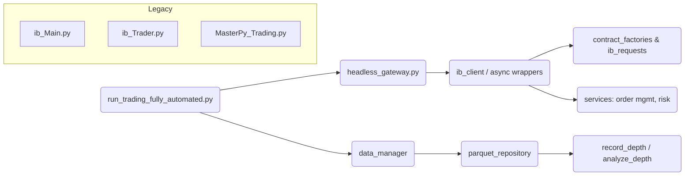

**NOTE:** Single authoritative README.

---

## Status

[](https://github.com/JSunRae/Trading/actions/workflows/ci.yml)
[](https://github.com/JSunRae/Trading/actions/workflows/cross-smoke-trading.yml)

## Table of Contents (Quick Navigation)

1. [Quick Start](#1-quick-start-90-use-case)
2. [Architecture Snapshot](#2-architecture-snapshot)
3. [Installation / Environment](#3-installation--environment)
4. [Automated Trading Usage](#4-automated-trading-usage)
5. [Level 2 Data](#5-level-2-order-book-data)
6. [Tooling & --describe](#6-tooling--describe)
7. [Testing & Quality Gates](#7-testing--quality-gates)
8. [Release Workflow](#8-release-workflow)
9. [Troubleshooting & Support](#9-troubleshooting--support)
10. [Coverage Targets](#10-coverage--incremental-targets)
11. [License](#11-license)
12. [Contributing](#12-contributing)
13. [Data Flows](#data-flows)
14. [Unified Environment Variables](#unified-environment-variables-authoritative)
15. [Condensed Backfill Quickstart](#quickstart-condensed)
16. [VS Code Tasks (One-click)](#vs-code-tasks-one-click)
17. [TF_1 ML Alignment](#tf_1-ml-alignment)

> Tip: All tools self‑document with `--describe`; see Section 6.

## 1. Quick Start (90% use‑case)

```bash
cd "/home/jrae/wsl projects/Trading"
source .venv/bin/activate  # Linux/Mac
python src/tools/setup/setup_automated_trading.py
python src/tools/run_trading_fully_automated.py --symbols AAPL
```

```bash
python src/tools/run_trading_fully_automated.py [OPTIONS]
```

Options (common):

- `--symbols SYM [SYM ...]` — Symbols to process (default: TSLA).
- `--duration STR` — Data duration window (e.g., `"1 D"`, `"5 D"`, `"1 W"`; default: `"1 D"`).
- `--bar-size STR` — Bar size (e.g., `"1 min"`, `"5 mins"`, `"1 hour"`; default: `"1 min"`).
- `--live` — Use live trading mode (default is paper mode when omitted).
- `--no-save` — Don’t write parquet/csv/summary outputs (analyze only).
- `--verbose` — More logging.
- `--describe` — Print tool metadata (inputs, outputs, env) and exit.

What happens automatically: start headless IB Gateway → login → request data → store (Parquet) → run analysis → produce signals → cleanup.

Prerequisites:

- Linux/WSL or macOS recommended; Windows supported via WSL.
- Python 3.10+ in a virtualenv at `.venv/` (auto-created by setup tool).
- Interactive Brokers Gateway or TWS installed and API enabled.
- Paths with spaces are supported; quote them (as shown above).

### Update Warrior (Quick Start)

Ensure your Databento API key is configured (see Installation / Environment). Then run:

```bash
python src/tools/auto_backfill_from_warrior.py [OPTIONS]
```

Options (common):

- `--dry-run` — Preview the scope (task count + first tasks); no vendor calls or writes.
- `--max-workers N` — Parallel workers (default from `L2_MAX_WORKERS` or 4).
- `--since DAYS` — Include tasks with `trading_day >= today - DAYS`.
- `--last N` — Keep only the last N distinct trading days (after other filters).
- `--strict` — Exit non‑zero if any errors occurred; still processes all tasks.
- `--force` — Redownload even if destination files already exist (overwrites).
- `--max-tasks N` — Cap total tasks processed (safety for large sets).

Verification: you’ll see a single SUMMARY line in stdout; artifacts are written under your configured data base path:

```
backfill_l2_manifest.jsonl   # Append per-task results
backfill_l2_summary.json     # Aggregate counts + concurrency
```

See details in [Warrior Historical L2 Backfill (Automation)](#warrior-historical-l2-backfill-automation).

**Automated Trading Flow:**

```mermaid
sequenceDiagram
    participant User
    participant Script as run_trading_fully_automated.py
    participant Gateway as HeadlessGateway
    participant IB as IB Gateway
    participant Data as DataManager
    participant Analysis as TradingAnalysis

    User->>Script: python src/tools/run_trading_fully_automated.py --symbols AAPL
    Script->>Gateway: Initialize headless gateway
    Gateway->>IB: Start IB Gateway (headless)
    IB-->>Gateway: Gateway ready ✅
    Gateway->>IB: Login with credentials
    IB-->>Gateway: Authentication success ✅

    Script->>Data: Request market data
    Data->>IB: Historical data request
    IB-->>Data: Market data response
    Data->>Analysis: Process data (Parquet format)

    Analysis->>Analysis: Generate trading signals
    Analysis-->>Script: Analysis complete
    Script->>Script: Save results & cleanup
    Script-->>User: Trading analysis complete! 🎉
```



---

## 2. Architecture Snapshot

Layers (green=modern, amber=legacy/transition):



### Detailed Architecture (grouped)

```mermaid
graph TB
    subgraph "🚀 AUTOMATED CORE (Phase 1 - COMPLETE)"
        A[run_trading_fully_automated.py] --> B[src/automation/headless_gateway.py]
    B --> C[src/lib/ib_async_wrapper.py]
  %% Removed legacy compatibility layer; using async infra only
        E[setup_automated_trading.py] --> A
    end

    subgraph "📊 ENTERPRISE DATA LAYER (COMPLETE)"
        F[src/core/config.py] --> G[src/core/error_handler.py]
        G --> H[src/core/connection_pool.py]
        H --> I[src/core/retry_manager.py]

        J[src/data/data_manager.py] --> K[src/data/parquet_repository.py]
        K --> L[src/data/record_depth.py]
        L --> M[src/data/analyze_depth.py]
    end

  subgraph "🧩 IB CLIENT INFRASTRUCTURE (NEW - COMPLETE)"
        N[ib_client.py] --> O[contract_factories.py]
        O --> P[ib_requests.py]
        P --> Q[project_types.py]
    end

  subgraph "�️ MODERNIZED SERVICES (Phase 1 - COMPLETE)"
        R[services/stock_split_detection_service.py]
        S[services/ml_order_management_service.py]
        T[risk/ml_risk_manager.py]
    end

    subgraph "⚠️ LEGACY COMPONENTS (Phase 2 - IN PROGRESS)"
        U[src/MasterPy_Trading.py]
        V[src/ib_Main.py]
        W[src/ib_Trader.py]
    end

    A --> N
    B --> N
    N --> R
    N --> S
    J --> T

    style A fill:#4CAF50,stroke:#333,stroke-width:2px,color:#fff
    style B fill:#4CAF50,stroke:#333,stroke-width:2px,color:#fff
    style C fill:#4CAF50,stroke:#333,stroke-width:2px,color:#fff
    style N fill:#2196F3,stroke:#333,stroke-width:2px,color:#fff
    style O fill:#2196F3,stroke:#333,stroke-width:2px,color:#fff
    style P fill:#2196F3,stroke:#333,stroke-width:2px,color:#fff
    style Q fill:#2196F3,stroke:#333,stroke-width:2px,color:#fff
    style U fill:#ff9800,stroke:#333,stroke-width:2px,color:#fff
    style V fill:#ff9800,stroke:#333,stroke-width:2px,color:#fff
```



### Project File Structure (high level)

```
Trading/
├── 🚀 **AUTOMATED CORE** (Phase 1 - COMPLETE)
│   ├── src/automation/headless_gateway.py    # Zero-intervention automation
│   ├── src/lib/ib_async_wrapper.py          # Modern async IB API
│   ├── run_trading_fully_automated.py       # One-command trading
│   └── setup_automated_trading.py           # Automated setup
│
├── 🧩 **IB CLIENT INFRASTRUCTURE** (NEW - COMPLETE)
│   ├── ib_client.py                        # Shared async IB client
│   ├── contract_factories.py               # Typed contract builders
│   ├── ib_requests.py                      # Typed request wrappers
│   └── project_types.py                    # Core type definitions
│
├── 📊 **ENTERPRISE DATA LAYER** (COMPLETE)
│   ├── src/core/
│   │   ├── config.py                       # Environment-based config
│   │   ├── error_handler.py                # Enterprise error management
│   │   ├── connection_pool.py              # Production connections
│   │   └── retry_manager.py                # Intelligent retries
│   │
│   ├── src/data/
│   │   ├── data_manager.py                 # Clean data access layer
│   │   ├── parquet_repository.py           # 25-100x performance gains
│   │   ├── record_depth.py                 # Real-time Level 2 data
│   │   └── analyze_depth.py                # Advanced market analysis
│   │
│   └── src/services/
│       ├── market_data/                    # Market data services
│       ├── execution/                      # Order execution
│       └── monitoring/                     # System monitoring
│
├── 🔧 **MODERNIZED SERVICES** (Phase 1 - COMPLETE)
│   ├── services/stock_split_detection_service.py  # ML-ready data
│   ├── services/ml_order_management_service.py    # Advanced orders
│   └── risk/ml_risk_manager.py                    # Risk management
│
└── ⚠️ **LEGACY COMPONENTS** (Phase 2 - NEXT)
    ├── src/MasterPy_Trading.py             # 2,500+ lines monolith
    ├── src/ib_Main.py                      # UI application
    ├── src/ib_Trader.py                    # Trading logic
    └── examples/                           # Legacy examples
```

Key points:

- Async-first IB client abstraction with safe fallback to a Fake IB for tests.
- Data layer standardized on Parquet (performance + schema evolution).
- Tools expose JSON `--describe` for automation.

### Gap / RVOL Recorder UI (Prototype)

Run the real-time gap-up + RVOL recorder (requires IB Gateway/TWS running; paper account OK):

```bash
python -m src.ui.gap_recorder_ui
```

Within ~10 seconds the table will populate with candidates (gap-up only, price $1–$30). Start Selected launches tick + (if slots free) Level 2 streams. Only 5 L2 streams run concurrently; additional selections are queued FIFO and auto-upgrade when a slot frees.

### Warrior Historical L2 Backfill (Automation)

Two CLIs support historical Level 2 backfill from DataBento:

- `backfill_l2_from_warrior.py` (legacy, sequential by default, now emits a SUMMARY line with concurrency)
- `auto_backfill_from_warrior.py` (modern orchestrator, parallel workers, deterministic manifest ordering)

Environment knobs:

| Variable                  | Purpose                                | Default |
| ------------------------- | -------------------------------------- | ------- |
| `L2_MAX_WORKERS`          | Orchestrator worker count (auto tool)  | 4       |
| `L2_BACKFILL_CONCURRENCY` | Legacy CLI concurrency (still honored) | 2       |
| `L2_TASK_BACKOFF_BASE_MS` | Vendor retry base backoff (ms)         | 250     |
| `L2_TASK_BACKOFF_MAX_MS`  | Vendor retry max backoff cap (ms)      | 2000    |

Logging: Progress & per-task START/END / ZERO_ROWS / ERROR go to the logger (stdout handler). Duplicate raw `print()` lines were removed to avoid doubled output; only the final `SUMMARY` line (and explicit ERROR lines in legacy path) are force-printed for test/CI parsing.

Artifacts (idempotent, shared across both paths):

```
backfill_l2_manifest.jsonl   # Append-only per task result (ordered deterministically)
backfill_l2_summary.json     # Overwritten each run with counts + concurrency
```

Example SUMMARY line:

```
SUMMARY WRITE=2 SKIP=0 EMPTY=0 ERROR=0 total=2 concurrency=4 duration=0.532s
```

Zero-task runs still emit:

```
SUMMARY WRITE=0 SKIP=0 EMPTY=0 ERROR=0 total=0 concurrency=2 duration=0.000s
```

Use `--max-workers` on the auto tool to override `L2_MAX_WORKERS`; legacy env `L2_BACKFILL_CONCURRENCY` is accepted as a fallback for continuity.

### Programmatic L2 Backfill (New)

You can now backfill a single (symbol, trading day) Level 2 slice directly via Python instead of only the CLI:

```python
from datetime import date
from src.services.market_data.backfill_api import backfill_l2

result = backfill_l2("AAPL", date(2025, 7, 29))
print(result["status"], result["rows"], result["path"])  # written|skipped|error
```

Behavior matches the CLI (`src/tools/backfill_l2_from_warrior.py`): idempotent, atomic Parquet write with `_databento` suffix, optional vendor availability, and structured result dict.

### Automatic Historical L2 Backfill from Warrior (New Orchestrator)

In addition to the legacy batch CLI (`backfill_l2_from_warrior.py`) a lightweight orchestrator + automation CLI is available for cron / CI.

Programmatic orchestration:

```python
from datetime import date
from src.services.market_data.warrior_backfill_orchestrator import find_warrior_tasks, run_warrior_backfill

tasks = find_warrior_tasks(since_days=7, last=3)  # discover unique (symbol, trading_day)
summary = run_warrior_backfill(tasks, force=False, strict=False)
print(summary["counts"], summary["zero_row_tasks"])
```

Automation CLI (single SUMMARY line; ideal for guardrails):

```bash
python src/tools/auto_backfill_from_warrior.py [OPTIONS]
```

See the options list in Update Warrior (Quick Start) above to avoid duplication.

Key properties:

| Aspect                 | Detail                                                                                |
| ---------------------- | ------------------------------------------------------------------------------------- |
| Idempotent             | Existing files skipped unless `--force`                                               |
| Zero-row handling      | Counted as `EMPTY` and in `zero_row_tasks`                                            |
| Artifacts              | Reuses `backfill_l2_manifest.jsonl` (append) & `backfill_l2_summary.json` (overwrite) |
| Status taxonomy        | `WRITE`, `SKIP`, `EMPTY`, `ERROR` (mirrors legacy CLI)                                |
| Dry-run                | JSON preview (count + first 10 tasks) without vendor calls or writes                  |
| Programmatic API       | `backfill_l2` (single), orchestrator (batch)                                          |
| Concurrency            | `--max-workers` flag / `L2_MAX_WORKERS` env (default 4). Set 1 for sequential.        |
| Deterministic manifest | Order always matches input order even under concurrency                               |

All files still use the `_databento` suffix for provenance; schema unchanged.

Note: The orchestrator and programmatic API classify vendor zero-row results as `EMPTY` (tracked separately from normal `SKIP`). This distinction is important for ML ingestion quality checks.

### Legacy Deprecation Notice

Legacy helper `WarriorList` now issues a `DeprecationWarning`. Use the programmatic API (`backfill_l2`) or the CLI tool instead. Additional legacy accessors will be deprecated in place—migration keeps surface stable while emitting warnings.

Core files of interest:
| Area | File | Purpose |
|------|------|---------|
| Automation | `src/tools/run_trading_fully_automated.py` | Orchestrates end-to-end run |
| Gateway | `src/automation/headless_gateway.py` | Headless start/login & lifecycle |
| IB Abstraction | `src/infra/ib_client.py` (or similar) | Unified client / fallback logic |
| Contracts | `src/infra/contract_factories.py` | Typed builders |
| Requests | `src/infra/ib_requests.py` | Typed request wrappers |
| Data | `src/data/data_manager.py` | High-level data orchestration |
| Depth | `src/data/record_depth.py` | Level 2 recorder |
| Depth Analysis | `src/data/analyze_depth.py` | Post-processing & metrics |
| Config | `src/core/config.py` | Centralized env + defaults |
| Error Handling | `src/core/error_handler.py` | Unified logging & escalation |

---

## 3. Installation / Environment

Project uses PEP 621 (`pyproject.toml`), Ruff (lint/format), Pyright/MyPy (types), Pytest.

```bash
python src/tools/setup/setup_automated_trading.py   # Installs deps, validates env
```

Configuration: override via `.env` (see `src/core/config.py`). Missing keys fall back to safe defaults.

Fake vs Real IB client resolution order:

1. `FORCE_FAKE_IB=1` → fake
2. Real `ib_async` available → real
3. Fallback → fake (never raises ImportError)

Useful env vars:
| Var | Purpose |
|-----|---------|
| `FORCE_FAKE_IB` | Force fake client (CI / offline) |
| `IB_USERNAME`, `IB_PASSWORD` | Automated headless auth |
| `IB_GATEWAY_HEADLESS` | Force headless launch (default on in automation tool) |

See also: `docs/ENVIRONMENT.md` for the authoritative list and examples. Boolean-like values accept `1/0`, `true/false`, or `yes/no`.

---

## 4. Automated Trading Usage

```bash
# Basic
python src/tools/run_trading_fully_automated.py --symbols AAPL

# Advanced options (examples)
python src/tools/run_trading_fully_automated.py --symbols AAPL MSFT --duration "5 D" --bar-size "5 mins"
python src/tools/run_trading_fully_automated.py --symbols SPY --live --no-save
```

Headless issues? Run manual gateway/TWS then re-run tool; it will detect existing session.

Connection quick checks:

```bash
python tests/test_gateway_ready.py              # default
python tests/test_gateway_ready.py --port 4002  # explicit
```

---

## 5. Level 2 (Order Book) Data

Record:

```bash
python src/tools/record_depth.py [OPTIONS]
```

Options (common):

- `--symbol, -s SYM` — Stock symbol to record (required).
- `--levels, -l N` — Levels per side (default: 10).
- `--interval, -i MS` — Snapshot interval in milliseconds (default: 100).
- `--output, -o PATH` — Output directory (default: ./data/level2).
- `--duration, -d MIN` — Duration in minutes (omit for indefinite session).
- `--host HOST` — IB host (default from config).
- `--port PORT` — IB port; auto-detected if omitted.
- `--client-id N` — IB API client id (default: 1).
- `--paper/--live` — Paper vs live mode (default: paper).
- `--describe` — Print tool metadata and exit.

Analyze:

```bash
python src/tools/analyze_depth.py [OPTIONS]
```

Options (common):

- `--data-dir, -d PATH` — Root data directory (e.g., ./data/level2).
- `--symbol, -s SYM` — Symbol to analyze.
- `--date YYYY-MM-DD` — Trading day to analyze.
- `--output, -o FILE` — Write analysis report JSON.
- `--plot` — Generate plots and display/save.
- `--show-describe` — Print tool description and exit.

Verification tip:

```bash
python src/tools/analyze_depth.py --show-describe
```

You should see a JSON schema with inputs/outputs; for a fast end-to-end check, run with a small sample once you have Level 2 data:

```bash
python src/tools/analyze_depth.py -d data/level2 -s SPY --date 2025-07-30 --output /dev/null
```

High frequency example (50ms, 20 levels, 30 minutes):

```bash
python src/tools/record_depth.py --symbol SPY --interval 50 --levels 20 --duration 30
```

Outputs per symbol directory: snapshots parquet, messages json, session stats.

Core metrics (via analyzer): order flow imbalance, volume profile, price impact, spread & depth dynamics.

### Level 2 Flow (visual)

```mermaid
flowchart TD
    A[📊 Level 2 Data Request] --> B[IB Gateway API]
    B --> C[record_depth.py]

    C --> D{Real-time Processing}
    D --> E[Order Book Snapshots<br/>100ms intervals]
    D --> F[Market Messages<br/>Event stream]

    E --> G[Parquet Storage<br/>25-100x faster]
    F --> H[JSON Event Log<br/>Message details]

    G --> I[analyze_depth.py]
    H --> I

    I --> J[📈 Order Flow Analysis]
    I --> K[💹 Volume Profile]
    I --> L[🎯 Price Impact Analysis]
    I --> M[📊 Market Microstructure]

    J --> N[🧠 ML Training Data]
    K --> N
    L --> N
    M --> N

    style A fill:#e3f2fd
    style G fill:#4caf50,color:#fff
    style H fill:#4caf50,color:#fff
    style N fill:#ff9800,color:#fff
```



### Level 2 File Layout

```
src/data/
├── record_depth.py      # Main Level 2 recorder
├── analyze_depth.py     # Analysis and replay tools
└── __init__.py         # Module initialization

data/level2/            # Data storage
├── {SYMBOL}/
│   ├── {YYYY-MM-DD}_snapshots_{HHMMSS}.parquet
│   ├── {YYYY-MM-DD}_messages_{HHMMSS}.json
│   └── session_stats_{YYYYMMDD_HHMMSS}.json
```

---

## 6. Tooling & `--describe`

Every script in `src/tools/` supports:

```bash
python <tool>.py --describe | jq
```

Returns JSON with: `description`, `input_schema`, `output_schema`.
Validate all:

```bash
pytest -q   # includes descriptor validation task
```

Representative tools: setup (`setup_automated_trading.py`), automation (`run_trading_fully_automated.py`), depth (`record_depth.py`, `analyze_depth.py`), maintenance (`maintenance/*`), analysis (`analysis/*`).

### Tool Catalog

| Tool ID                      | Entry Command                                              | Example `--describe` Command                                          |
| ---------------------------- | ---------------------------------------------------------- | --------------------------------------------------------------------- |
| verify_setup                 | `python src/tools/verify_setup.py`                         | `python src/tools/verify_setup.py --describe`                         |
| quick_start                  | `python src/tools/quick_start.py`                          | `python src/tools/quick_start.py --describe`                          |
| migration_guide              | `python src/tools/migration_guide.py`                      | `python src/tools/migration_guide.py --describe`                      |
| integration_examples         | `python src/tools/integration_examples.py`                 | `python src/tools/integration_examples.py --describe`                 |
| phase2_progress_demo         | `python src/tools/phase2_progress_demo.py`                 | `python src/tools/phase2_progress_demo.py --describe`                 |
| demo_stock_split_integration | `python src/tools/demo_stock_split_integration.py`         | `python src/tools/demo_stock_split_integration.py --describe`         |
| run_trading_fully_automated  | `python src/tools/run_trading_fully_automated.py`          | `python src/tools/run_trading_fully_automated.py --describe`          |
| analyze_depth                | `python src/tools/analyze_depth.py`                        | `python src/tools/analyze_depth.py --describe`                        |
| record_depth                 | `python src/tools/record_depth.py`                         | `python src/tools/record_depth.py --describe`                         |
| backfill_l2_from_warrior     | `python src/tools/backfill_l2_from_warrior.py`             | `python src/tools/backfill_l2_from_warrior.py --describe`             |
| analyze_scripts              | `python src/tools/analysis/analyze_scripts.py`             | `python src/tools/analysis/analyze_scripts.py --describe`             |
| system_check_analysis        | `python src/tools/analysis/system_check_analysis.py`       | `python src/tools/analysis/system_check_analysis.py --describe`       |
| validate_ml_structure        | `python src/tools/analysis/validate_ml_structure.py`       | `python src/tools/analysis/validate_ml_structure.py --describe`       |
| script_inventory_analyzer    | `python src/tools/analysis/script_inventory_analyzer.py`   | `python src/tools/analysis/script_inventory_analyzer.py --describe`   |
| scan_data                    | `python src/tools/maintenance/scan_data.py`                | `python src/tools/maintenance/scan_data.py --describe`                |
| system_analysis (new)        | `python src/tools/system_analysis.py`                      | `python src/tools/system_analysis.py --describe`                      |
| system_analysis (legacy)     | `python src/tools/maintenance/system_analysis.py`          | `python src/tools/maintenance/system_analysis.py --describe`          |
| architecture_demo            | `python src/tools/maintenance/architecture_demo.py`        | `python src/tools/maintenance/architecture_demo.py --describe`        |
| senior_architect_review      | `python src/tools/maintenance/senior_architect_review.py`  | `python src/tools/maintenance/senior_architect_review.py --describe`  |
| migrate_excel_to_parquet     | `python src/tools/maintenance/migrate_excel_to_parquet.py` | `python src/tools/maintenance/migrate_excel_to_parquet.py --describe` |
| run_data_update              | `python src/tools/maintenance/run_data_update.py`          | `python src/tools/maintenance/run_data_update.py --describe`          |
| update_data                  | `python src/tools/maintenance/update_data.py`              | `python src/tools/maintenance/update_data.py --describe`              |
| setup_automated_trading      | `python src/tools/setup/setup_automated_trading.py`        | `python src/tools/setup/setup_automated_trading.py --describe`        |
| setup_ib_gateway             | `python src/tools/setup/setup_ib_gateway.py`               | `python src/tools/setup/setup_ib_gateway.py --describe`               |
| fix_hardcoded_paths          | `python src/tools/setup/fix_hardcoded_paths.py`            | `python src/tools/setup/fix_hardcoded_paths.py --describe`            |
| setup_critical_fixes         | `python src/tools/setup/setup_critical_fixes.py`           | `python src/tools/setup/setup_critical_fixes.py --describe`           |

---

## 7. Testing & Quality Gates

Common commands:

```bash
pytest -q --cov=src --cov-report=term-missing
ruff check src/ tests/
ruff format --check
npx pyright
```

Run full suite with coverage HTML:

```bash
pytest tests/ --cov=src --cov-report=html
```

Fake client used by default; integration tests requiring real IB are marked and skipped when unavailable.

VS Code users: tasks exist for one-click runs (Install, Lint, Tests, Coverage). See section "VS Code Tasks" below.

Performance / diagnostics (optional): `tests/test_parquet_performance.py`, `tests/test_memory_usage.py`.

Pre-commit:

```bash
pip install pre-commit
pre-commit install
pre-commit run --all-files
```

---

## 8. Release Workflow

```bash
pre-commit run --all-files
pytest -q --cov=src
ruff check src/ tests/
npx pyright
```

Then:

```bash
git commit -am "chore(release): vX.Y.Z"
git tag -a vX.Y.Z -m "Release vX.Y.Z"
git push origin main --tags
```

Maintain `CHANGELOG.md` (Keep a Changelog + SemVer).

---

## 9. Troubleshooting & Support

### Support Resources

#### Log Files

- Application: `logs/trading.log`
- Errors: `logs/error.log`
- IB API: `logs/api.*.log`
- Performance: `logs/performance.log`

#### Diagnostic Commands

```bash
# System info
python scripts/system_info.py

# Configuration check
python scripts/check_config.py

# Dependency verification
pip check

# Full setup verification
python scripts/verify_setup.py
python scripts/diagnose_system.py
```

Data format migration (Excel → Parquet):

```bash
python src/tools/maintenance/migrate_excel_to_parquet.py
```

If depth slow: confirm Parquet usage:

```bash
ls data/level2/*/*.parquet
```

### Automated Trading & Gateway

Common symptoms and actions:

| Symptom            | Check                                                     |
| ------------------ | --------------------------------------------------------- |
| Connection refused | Is gateway process running? (`ps aux \| grep -i gateway`) |
| Auth failed        | Env credentials exported?                                 |
| API not enabled    | TWS/Gateway: API Settings → Enable Socket Clients         |
| WSL access issues  | Add WSL host IP to trusted IP list                        |

Tips:

- If headless launch fails, start Gateway/TWS manually and re-run the tool; it will attach to the existing session.
- Validate ports with the quick checks above; defaults are 4002 (paper), 4001 (live).

### Level 2 Data (record/analyze)

| Issue                    | Explanation                                   | Action                                                                                                |
| ------------------------ | --------------------------------------------- | ----------------------------------------------------------------------------------------------------- |
| No snapshots written     | Session ended early or no subscription        | Increase duration; confirm symbol is valid and market hours; check logs in `logs/`                    |
| High CPU/memory          | Very small intervals (<=50ms) and many levels | Reduce `--levels` or increase `--interval`; ensure Parquet writes are enabled                         |
| Analyzer can’t find data | Path/symbol/date mismatch                     | Verify directory layout under `data/level2/{SYMBOL}/` and the `--data-dir`, `--symbol`, `--date` args |

### Backfill (DataBento / Warrior)

| Issue                           | Explanation                                | Action                                                                                |
| ------------------------------- | ------------------------------------------ | ------------------------------------------------------------------------------------- |
| Zero-row day (EMPTY)            | Vendor returned no rows in window          | Verify symbol/day activity; adjust `L2_BACKFILL_WINDOW_ET`; harmless unless strict    |
| Rate-limit / retries            | Vendor 429 / transient network             | Backoff auto-handled; tune `L2_TASK_BACKOFF_BASE_MS/MAX_MS` or lower `L2_MAX_WORKERS` |
| Strict mode non-zero exit       | `--strict` treats UNAVAIL/ERROR as failure | Re-run without `--strict` to proceed; inspect logs & SUMMARY counters                 |
| Symbol-mapping identity warning | Mapping file missing or empty              | Provide `SYMBOL_MAPPING_FILE` with explicit vendor symbols if divergences exist       |
| Mixed concurrency values        | Using legacy env only                      | Prefer `L2_MAX_WORKERS`; legacy `L2_BACKFILL_CONCURRENCY` used as fallback            |

Note on timezones: All backfill session windows are specified in ET with DST respected. The configured ET windows (e.g., `L2_BACKFILL_WINDOW_ET`, `L2_TRADING_WINDOW_ET`) are enforced per trading day and converted to UTC internally to ensure correct boundaries across DST changes.

---

## 10. Coverage & Incremental Targets

Some complex/IO heavy or legacy-transition modules intentionally excluded or partially covered (gateway shims, long-lived loops, legacy UIs). Focus backlog:

1. Extract pure alert evaluators from performance/risk modules.
2. Break dataframe safety utilities into granular testable helpers.
3. Add deterministic tests for retry / circuit-break transitions.

Reproduce coverage report:

```bash
pytest --cov=src --cov-branch --cov-report=xml:coverage.xml
```

---

## 11. License

See `LICENSE`.

---

## 12. Contributing

Small PRs preferred. Include:

1. Tests (or justification) 2. Type hints 3. Passing quality gates 4. Updated README / CHANGELOG when user-visible.

---

Questions? Run the `quick_start` or `verify_setup` tools with `--describe` for structured guidance.

## Data Flows

```mermaid
flowchart LR
    Warrior[Warrior Trades Excel/Source] -->|task discovery| Tasks[Unique (Symbol, Day) Tasks]
    Tasks -->|08:00–11:30 ET window| Fetch[DataBento Fetch]
    Fetch --> Adapter[Vendor Adapter]\n
    Adapter --> Parquet[(Parquet L2 Snapshots *_databento)]
    Parquet --> ML[ML Workflows]
    Parquet --> Analysis[Depth / Microstructure Analysis]
    ML --> Monitoring[Monitoring & Guardrails]
    Analysis --> Monitoring
```

The system discovers candidate (symbol, trading day) tasks from Warrior trade history, filters by the configured ET window (default 08:00–11:30), fetches historical Level 2 from DataBento via an adapter that emits parquet files schema‑compatible with live IBKR L2 capture (distinguished only by the `_databento` suffix), then feeds identical downstream ML feature generation, analysis, and monitoring pipelines.

## Unified Environment Variables (Authoritative)

See also: `docs/ENVIRONMENT.md` (kept in sync) and `.env.example`.

| Key                       | Default                      | Purpose                                 | Used By                    |
| ------------------------- | ---------------------------- | --------------------------------------- | -------------------------- |
| ML_BASE_PATH              | ~/Machine Learning           | Root ML data directory                  | config, data manager       |
| ML_BACKUP_PATH            | ~/T7 Backup/Machine Learning | Backup mirror for critical files        | backup utilities           |
| LOGS_PATH                 | logs                         | Log file directory                      | logging setup              |
| TEMP_PATH                 | temp                         | Temp workspace (atomic writes, staging) | backfill, data ops         |
| CONFIG_PATH               | config                       | Config storage (generated JSON)         | config manager             |
| DATA_PATH_OVERRIDE        | ./data                       | Override base data path (legacy compat) | data access                |
| FILES_PATH                | ./Files                      | Legacy files directory                  | legacy loaders             |
| CACHE_PATH                | ./cache                      | Cache directory                         | performance caching        |
| IB_HOST                   | 127.0.0.1                    | IBKR host (Gateway/TWS)                 | gateway, clients           |
| IB_LIVE_PORT              | 7496                         | Live TWS/Gateway port                   | ib connection              |
| IB_PAPER_PORT             | 7497                         | Paper TWS/Gateway port                  | ib connection              |
| IB_GATEWAY_LIVE_PORT      | 4001                         | Headless gateway live port              | headless gateway           |
| IB_GATEWAY_PAPER_PORT     | 4002                         | Headless gateway paper port             | headless gateway           |
| IB_CLIENT_ID              | 1                            | Client id for session                   | ib connection              |
| IB_PAPER_TRADING          | 1                            | Paper vs live flag                      | connection config          |
| IB_USERNAME               | (empty)                      | Headless auth username                  | headless gateway           |
| IB_PASSWORD               | (empty)                      | Headless auth password                  | headless gateway           |
| FORCE_FAKE_IB             | 0                            | Force fake IB client                    | tests / offline            |
| DEFAULT_DATA_FORMAT       | parquet                      | Primary on-disk format                  | data manager               |
| BACKUP_FORMAT             | csv                          | Backup export format                    | backup utilities           |
| EXCEL_ENGINE              | openpyxl                     | Excel reader/writer                     | legacy IO                  |
| MAX_WORKERS               | 4                            | Generic parallel worker cap             | misc parallel ops          |
| CHUNK_SIZE                | 1000                         | Chunk size for batched IO               | data manager               |
| CACHE_SIZE_MB             | 512                          | In-memory cache target                  | caching layer              |
| CONNECTION_TIMEOUT        | 30                           | IB connection timeout (s)               | gateway, requests          |
| RETRY_ATTEMPTS            | 3                            | Generic retry attempts                  | retry logic                |
| DATABENTO_ENABLE_BACKFILL | 0                            | Enable DataBento backfill               | orchestrator               |
| DATABENTO_API_KEY         | (empty)                      | DataBento API key                       | vendor adapter             |
| DATABENTO_DATASET         | XNAS.ITCH                    | Dataset code                            | vendor adapter             |
| DATABENTO_SCHEMA          | mbp-10                       | L2 schema                               | vendor adapter             |
| DATABENTO_TZ              | America/New_York             | Vendor timezone                         | backfill window            |
| L2_BACKFILL_WINDOW_ET     | 09:00-11:00                  | Historical slice window (ET)            | backfill_api               |
| L2_ENFORCE_TRADING_WINDOW | 1                            | Clamp L2 fetch to trading window (ET)   | backfill_api               |
| L2_TRADING_WINDOW_ET      | 09:00-11:00                  | Trading window for Level 2 (ET)         | backfill_api               |
| L2_BACKFILL_CONCURRENCY   | 2                            | Legacy CLI concurrency                  | backfill_l2_from_warrior   |
| L2_MAX_WORKERS            | 4                            | Orchestrator workers                    | auto_backfill_from_warrior |
| L2_TASK_BACKOFF_BASE_MS   | 250                          | Base backoff ms (vendor retry)          | databento_l2_service       |
| L2_TASK_BACKOFF_MAX_MS    | 2000                         | Max backoff ms                          | databento_l2_service       |
| SYMBOL_MAPPING_FILE       | config/symbol_mapping.json   | Local→vendor mapping                    | backfill & mapping         |
| LOG_LEVEL                 | INFO                         | Log verbosity                           | orchestrators, batch tools |

## Quickstart (Condensed)

```bash
# 1. Create your .env from example and edit secrets
cp .env.example .env
# (edit IB creds / API keys as needed)

# 2. Dry-run Warrior→DataBento task discovery (no writes)
python src/tools/auto_backfill_from_warrior.py --dry-run

# 3. Run strict backfill then inspect summary + first manifest lines
python src/tools/auto_backfill_from_warrior.py --max-workers 4 --strict
head -n 5 backfill_l2_manifest.jsonl
cat backfill_l2_summary.json
```

<!-- Consolidated into Section 9: Troubleshooting & Support -->

### Historical L2 Backfill (DataBento Optional)

Updated: this section is superseded by Unified Environment Variables & Quickstart. Retained for legacy context; new users should follow the Quickstart above. DataBento usage is restricted to historical Level 2 only. Other historical data paths use the standard sources to avoid extra vendor costs.

Install extra (optional):

```
pip install -e .[databento]
```

Environment keys (add to `.env` or leave defaults):

```
DATABENTO_API_KEY=your_key_here
DATABENTO_ENABLE_BACKFILL=1
DATABENTO_DATASET=XNAS.ITCH
DATABENTO_SCHEMA=mbp-10
L2_BACKFILL_WINDOW_ET=09:00-11:00
L2_ENFORCE_TRADING_WINDOW=1
L2_TRADING_WINDOW_ET=09:00-11:00
L2_BACKFILL_CONCURRENCY=2
SYMBOL_MAPPING_FILE=config/symbol_mapping.json
```

Usage:

```
python src/tools/backfill_l2_from_warrior.py --date 2025-07-29
python src/tools/backfill_l2_from_warrior.py --start 2025-07-01 --end 2025-07-05 --symbol AAPL
```

Writes parquet in IBKR-compatible L2 schema. Filenames are suffixed with
`_databento` (e.g. `2025-07-29_snapshots_databento.parquet`) to avoid any
collision with live IBKR Level 2 capture files.

Characteristics:

- Atomic writes: data is written to a temporary `*.tmp` file then atomically
  moved into place to avoid partial files on interruption.
- Idempotent: existing files are skipped (status `SKIP`) unless `--force` is
  supplied (then status `WRITE`).
- Concurrency: bounded by `L2_BACKFILL_CONCURRENCY` (>=1). Set to `1` for
  deterministic serial operation during debugging.
- Time window: configurable via `L2_BACKFILL_WINDOW_ET` (default `08:00-11:30`)
  and DST-aware (America/New_York).
- Mapping: local symbol -> vendor symbol via JSON mapping file path provided by
  `SYMBOL_MAPPING_FILE` (identity mapping if missing / empty).
- Optional dependency: If the DataBento SDK or API key is missing the tool will
  emit `WARN` or `UNAVAIL` statuses but still exit cleanly (unless `--strict`).

Flags:

- `--force` overwrite existing suffixed parquet files.
- `--dry-run` show which actions would be taken without writing.
- `--strict` treat vendor unavailability as a hard error (non-zero exit).
- `--max-tasks N` limit number of tasks processed after filtering (safety for large sets).
- `--since YYYY-MM-DD` only include warrior entries on/after this date.
- `--last N` keep only the last N distinct trading days after other filters (e.g. recent days).

Exit summary line always includes a `concurrency=N` indicator for testability.

---

## VS Code Tasks (One-click)

Common tasks are preconfigured in `.vscode/tasks.json` and surfaced in this workspace:

- Install Dependencies: set up the virtual environment with dev extras.
- Lint with Ruff: static analysis of `src/`, `tests/`, and `examples/`.
- Format with Ruff: format code consistently.
- Type Check with mypy / Pyright: static types for Python.
- Run Tests / Run Tests with Coverage: execute the test suite and generate `coverage.json`.
- Describe All Tools: validate every `--describe` output is valid JSON.
- Nightly L2 Backfill: example batch settings for Warrior → DataBento automation.

You can run tasks via Terminal → Run Task… in VS Code.

---

## TF_1 ML Alignment

A dedicated document captures all hand-offs and contracts between this trading platform and the ML-centric project TF_1. See `docs/TF_1_ALIGNMENT.md` for:

- Data contracts (parquet schemas, filenames, and directories)
- Manifests and run artifacts (`backfill_l2_manifest.jsonl`, `backfill_l2_summary.json`)
- Environment variables and path conventions shared across repos
- Programmatic APIs available for ML ingestion (e.g., `backfill_l2`, discovery APIs)
- Operational concerns (concurrency, idempotence, zero-row handling)
- CI/CD and versioning recommendations to avoid breaking changes

This section is intentionally brief; refer to the doc for full details.

### Contracts and Validator

- The directory `contracts/` is a git submodule that hosts shared ML contracts: schemas, rules, and canonical fixtures. Do not edit files under `contracts/` locally; propose changes upstream in the contracts repo.
- All session windows are specified in ET and respect DST transitions. Backfill logic enforces ET windows and converts to UTC internally.
- The TF_1 export manifest validator rejects unknown `schema_version` values and fails when the `production.alias` is missing for promoted models. A `production.alias` file in the model directory is required for non-dry emissions.

### 🌟 North-Star: Trading + ML Ecosystem Alignment

This ecosystem is designed around clear separation of concerns with a single shared source of truth for contracts.

## Repositories & Roles

# ml-contracts

Scope: Canonical schemas, promotion rules, and L2 fixtures.
Governance: Versioned, tagged, CODEOWNERS enforced.
Responsibility: Defines what “valid” looks like. No model code, no trading logic.

# TF_1 (Machine Learning)

Scope: Data preparation, deep learning models (CNN/LSTM/Transformers), evaluation, export.
Responsibility: Train → evaluate → export → promote ML models.
Boundary: Consumes contracts/ as a submodule. Produces manifests + models.
Explicit Non-Goals: No execution, no broker logic, no order routing.

# Trading Platform

Scope: Market data ingestion, backfill, execution orchestration, observability.
Responsibility: Use validated contracts + manifests from TF_1.
Boundary: No ML training or experiment management.

## 🔄 Flow of Responsibility

Contracts: Define schemas + promotion thresholds (ml-contracts).
Modeling: Train, evaluate, and export models (TF_1) → validated against contracts.
Execution: Consume model manifests + signals (Trading) → enforce risk, P&L, compliance.

🚧 Guardrails

Contracts-first: All schema/rule/fixture evolution starts in ml-contracts.
Pre-commit hooks: Prevent local drift (no duplicate schema/rules in TF_1 or Trading).
Cross-repo smoke CI: Each repo validates artifacts against contracts.
Branch protection: Only reviewed, green builds hit main.

🎯 North-Star

Keep each repo laser-focused:
ml-contracts = the law.
TF_1 = build the brains.
Trading = run the business.
This preserves velocity, enforces trust, and ensures Future You (and collaborators) always know where to look.
