**NOTE:** This is the **only README.md** file. All documentation updates must go here. Do not create new readme or guide files.

---

## 🚀 **Quick Start**

```bash
# One command - everything happens automatically!
python src/tools/run_trading_fully_automated.py --symbols AAPL

# Multiple symbols with custom analysis
python src/tools/run_trading_fully_automated.py --symbols AAPL MSFT GOOGL --analysis advanced

# Paper trading (recommended for testing)
python src/tools/run_trading_fully_automated.py --symbols TSLA --paper
```

**Automated Trading Flow:**

```mermaid
sequenceDiagram
    participant User
    participant Script as run_trading_fully_automated.py
    participant Gateway as HeadlessGateway
    participant IB as IB Gateway
    participant Data as DataManager
    participant Analysis as TradingAnalysis

    User->>Script: python src/tools/run_trading_fully_automated.py --symbols AAPL
    Script->>Gateway: Initialize headless gateway
    Gateway->>IB: Start IB Gateway (headless)
    IB-->>Gateway: Gateway ready ✅
    Gateway->>IB: Login with credentials
    IB-->>Gateway: Authentication success ✅

    Script->>Data: Request market data
    Data->>IB: Historical data request
    IB-->>Data: Market data response
    Data->>Analysis: Process data (Parquet format)

    Analysis->>Analysis: Generate trading signals
    Analysis-->>Script: Analysis complete
    Script->>Script: Save results & cleanup
    Script-->>User: Trading analysis complete! 🎉
```



**What this does automatically:**

1. 🤖 **Starts IB Gateway** in headless mode
2. 🔐 **Logs in** with your credentials
3. 📊 **Downloads market data** for specified symbols
4. 🧠 **Runs analysis** and generates signals
5. 💾 **Saves results** to files
6. 🧹 **Cleans up** automatically

### **⚡ 2-Minute Setup**

```bash
# 1. Clone and setup environment
cd "/home/jrae/wsl projects/Trading"
source .venv/bin/activate  # Linux/Mac

# 2. One-command setup (installs everything)
python src/tools/setup/setup_automated_trading.py

# 3. Start trading immediately
python src/tools/run_trading_fully_automated.py --symbols AAPL
```

---

## 📈 Test Coverage Status

- Overall line coverage: 80.36%
- Branch coverage: 64.08%
- Per-module breakdown is generated at `reports/coverage_analysis.json` by `src/tools/analysis/generate_coverage_analysis.py`.

Notes on coverage scope:

- We focus coverage on unit-testable core. The following infra-heavy modules are omitted from coverage totals (tracked separately):
  - src/core/performance.py, src/core/integrated_error_handling.py, src/core/connection_pool.py, src/core/error_handler.py, src/core/retry_manager.py
  - src/risk/ml_risk_manager.py, src/domain/interfaces.py, src/infra/\*, src/data/pandas_helpers.py
- Run the analyzer after tests to refresh the JSON summary:
  - python -m pytest --cov=src --cov-report=xml
  - python src/tools/analysis/generate_coverage_analysis.py # writes reports/coverage_analysis.json

Recent quality updates:

- Eliminated pandas FutureWarning in mixed-dtype row fill by per-column assignment with dtype upcast where needed.
- Hardened ExcelRepository with safe fallback paths and safe IO wrappers.
- DownloadTracker save methods avoid ambiguous 'Stock' column and reliably reset change counters.

---

## �🔌 **Connection Setup Guide**

### **🚀 Method 1: Fully Automated (Recommended)**

**Complete process - environment activation through trading:**

```bash
# 1. Navigate to project and activate environment (note the space in path)
cd "/home/jrae/wsl projects/Trading"
source .venv/bin/activate

# 2. Set IB credentials (one-time setup)
export IB_USERNAME="your_username"
export IB_PASSWORD="your_password"
# OR create .env file with credentials

# 3. Start automated trading (gateway starts automatically)
python src/tools/run_trading_fully_automated.py --symbols AAPL

# That's it! Gateway connection is handled automatically
```

**What happens automatically:**

- ✅ Virtual environment activated
- ✅ IB Gateway starts in headless mode
- ✅ Authentication with your credentials
- ✅ Connection established and verified
- ✅ Ready for trading operations

### **🎮 Method 2: Manual TWS/Gateway Connection**

**Step-by-step manual connection:**

```bash
# 1. Activate environment
cd "/home/jrae/wsl projects/Trading"
source .venv/bin/activate

# 2. Start IB Gateway or TWS manually
# - Open IB Gateway or TWS application
# - Login with your credentials
# - Go to Configuration → API → Settings
# - Enable "Enable ActiveX and Socket Clients"
# - Set Socket Port: 4002 (Gateway paper) or 4001 (Gateway live)
#                   7497 (TWS paper) or 7496 (TWS live)
# - Add trusted IP: 127.0.0.1

# 3. Verify connection
python tests/test_gateway_ready.py

# 4. Start trading application
python src/ib_Main.py
```

### **🔧 WSL-Specific Connection Setup**

**For WSL users (Windows Subsystem for Linux):**

```bash
# 1. Find your WSL IP address
ip route | grep default
# Note the IP (e.g., 172.20.240.1)

# 2. In TWS/Gateway, add WSL IP to trusted IPs
# Configuration → API → Settings → Trusted IPs
# Add: 127.0.0.1 and your WSL IP (e.g., 172.20.240.1)

# 3. Test connection with WSL IP
python tests/test_gateway_ready.py --host 172.20.240.1 --port 4002
```

### **✅ Connection Verification**

```bash
# Test connection status
python tests/test_gateway_ready.py

# Test with specific settings
python tests/test_gateway_ready.py --port 4002 --client-id 1
```

### **🚨 Connection Troubleshooting**

**Common connection issues and solutions:**

```bash
# Issue: "Connection refused"
# Solution: Check if gateway is running
ps aux | grep -i gateway
# If not running, start TWS/Gateway or use automated mode

# Issue: "Authentication failed"
# Solution: Verify credentials
echo $IB_USERNAME
echo $IB_PASSWORD
python src/automation/headless_gateway.py --test-auth

# Issue: "WSL connection problems"
# Solution: Check WSL networking
ip route | grep default
ping google.com  # Test internet connectivity

# Issue: "API not enabled"
# Solution: Enable API in TWS
# Configuration → API → Settings → Enable Socket Clients ✅
```

### **📋 Quick Connection Checklist**

Before starting trading operations, ensure:

- [ ] Virtual environment activated (`source .venv/bin/activate`)
- [ ] IB credentials set (environment variables or .env file)
- [ ] IB Gateway/TWS running (manual) OR using automated mode
- [ ] API enabled in TWS settings (if manual)
- [ ] Connection test passes (`python tests/test_gateway_ready.py`)
- [ ] Market hours verified (if expecting live data)

---

## 🏗️ **Architecture**

### **Modern Hybrid Architecture (68% Modernized)**


### **🤖 Automated Trading**

```bash
# Fully automated Tesla analysis
python src/tools/run_trading_fully_automated.py --symbols TSLA

    J --> P

    style A fill:#4CAF50,stroke:#333,stroke-width:2px,color:#fff
    style B fill:#4CAF50,stroke:#333,stroke-width:2px,color:#fff
    style C fill:#4CAF50,stroke:#333,stroke-width:2px,color:#fff
    style Q fill:#ff9800,stroke:#333,stroke-width:2px,color:#fff
    style R fill:#ff9800,stroke:#333,stroke-width:2px,color:#fff
```

**File Structure:**

```
Trading/
├── 🚀 **AUTOMATED CORE** (Phase 1 - COMPLETE)
│   ├── src/automation/headless_gateway.py    # Zero-intervention automation
│   ├── src/lib/ib_async_wrapper.py          # Modern async IB API
│   ├── src/lib/ib_insync_compat.py          # Backward compatibility
│   ├── run_trading_fully_automated.py       # One-command trading
│   └── setup_automated_trading.py           # Automated setup
│
├── � **IB CLIENT INFRASTRUCTURE** (NEW - COMPLETE)
│   ├── ib_client.py                        # Shared async IB client
│   ├── contract_factories.py               # Typed contract builders
│   ├── ib_requests.py                      # Typed request wrappers
│   └── project_types.py                    # Core type definitions
│
├── �📊 **ENTERPRISE DATA LAYER** (COMPLETE)
│   ├── src/core/
│   │   ├── config.py                       # Environment-based config
│   │   ├── error_handler.py                # Enterprise error management
│   │   ├── connection_pool.py              # Production connections
│   │   └── retry_manager.py                # Intelligent retries
│   │
│   ├── src/data/
│   │   ├── data_manager.py                 # Clean data access layer
│   │   ├── parquet_repository.py           # 25-100x performance gains
│   │   ├── record_depth.py                 # Real-time Level 2 data
│   │   └── analyze_depth.py                # Advanced market analysis
│   │
│   └── src/services/
│       ├── market_data/                    # Market data services
│       ├── execution/                      # Order execution
│       └── monitoring/                     # System monitoring
│
├── 🔧 **MODERNIZED SERVICES** (Phase 1 - COMPLETE)
│   ├── services/stock_split_detection_service.py  # ML-ready data
│   ├── services/ml_order_management_service.py    # Advanced orders
│   └── risk/ml_risk_manager.py                    # Risk management
│
└── ⚠️ **LEGACY COMPONENTS** (Phase 2 - NEXT)
    ├── src/MasterPy_Trading.py             # 2,500+ lines monolith
    ├── src/ib_Main.py                      # UI application
    ├── src/ib_Trader.py                    # Trading logic
    └── examples/                           # Legacy examples
```

### **Performance Achievements**

- **Data Operations**: 25-100x faster (Parquet vs Excel)
- **Error Reduction**: 93% fewer errors (from 2,792 to 38)
- **Manual Steps**: 100% elimination (6-8 steps → 0 steps)
- **Setup Time**: 93% reduction (30+ minutes → 2 minutes)
- **Server Ready**: 100% headless capable

---

## 🔌 **IB Client Infrastructure**

### **NEW: Centralized Async IB Client**

The project now includes a **type-safe, centralized IB client infrastructure** that eliminates scattered `IB()` instances and provides consistent async patterns:

```python
# ✅ NEW: Centralized infrastructure
from ib_client import get_ib, close_ib
from contract_factories import stock
from ib_requests import req_hist
from project_types import Symbol

async def trading_function():
    try:
        # Shared client with automatic connection management
        ib = await get_ib()

        # Type-safe contract creation
        contract = stock(Symbol("AAPL"))

        # Typed request wrapper
        bars = await req_hist(contract, duration="1 D", bar_size="1 min")

    finally:
        # Graceful shutdown
        await close_ib()
```

### **🏗️ Infrastructure Components**

| File                    | Purpose                 | Key Features                               |
| ----------------------- | ----------------------- | ------------------------------------------ |
| `ib_client.py`          | Shared async IB client  | Connection pooling, automatic reconnection |
| `contract_factories.py` | Typed contract builders | Type-safe `stock()`, `forex()`, `future()` |
| `ib_requests.py`        | Request wrappers        | Typed `req_hist()`, `req_market_data()`    |
| `project_types.py`      | Core type definitions   | `Symbol`, `BarSize`, `Exchange`, etc.      |

### **🎯 Migration Status**

**Infrastructure Complete**: 34 migration opportunities identified across 14 files

```bash
# Run migration analysis
python ib_migration_helper.py

# See usage examples
python ib_migration_demo.py
```

## 📦 **Installation & Setup**

## 🛠️ Centralized Configuration (.env)

All filesystem paths, filenames, and environment-dependent settings are centralized through `src/core/config.py`. Override defaults via a project root `.env`. Missing keys fall back to safe defaults so the project still runs with zero config.

Example `.env`:

```
ML_BASE_PATH=~/Machine\ Learning
ML_BACKUP_PATH=~/Machine\ Learning/backups
LOGS_PATH=./logs
TEMP_PATH=./temp
CONFIG_PATH=./config
IB_FAILED_STOCKS_FILENAME=IB Failed Stocks.xlsx
IB_DOWNLOADABLE_STOCKS_FILENAME=IB Downloadable Stocks.xlsx
IB_DOWNLOADED_STOCKS_FILENAME=IB Downloaded Stocks.xlsx
WARRIOR_TRADES_FILENAME=WarriorTrading_Trades.xlsx
TRAIN_LIST_PREFIX=Train_List-
IB_DOWNLOADS_DIRNAME=IBDownloads
LEVEL2_DIRNAME=Level2
REQUEST_CHECKER_BIN=Files/requestChecker.bin
IB_HOST=127.0.0.1
IB_PORT=4002
IB_CLIENT_ID=1
IB_PAPER=1
```

Usage:

```python
from src.core.config import get_config
cfg = get_config()
failed = cfg.get_data_file_path("ib_failed_stocks")
warrior = cfg.get_data_file_path("warrior_trading_trades")
train = cfg.get_data_file_path("train_list", symbol="Test")
checker = cfg.get_special_file("request_checker_bin")
```

See `docs/migration_paths_log.md` for full migration details.

## 🛠️ Centralized Configuration (.env)

All filesystem paths, filenames, and environment-dependent settings are now centralized through `src/core/config.py`. Override defaults via a project root `.env` file (same directory as `pyproject.toml`). If a variable is omitted, a safe default is used so the project still runs out-of-the-box.

Example `.env` snippet:

```
# Base paths
ML_BASE_PATH=~/Machine\ Learning
ML_BACKUP_PATH=~/Machine\ Learning/backups
LOGS_PATH=./logs
TEMP_PATH=./temp
CONFIG_PATH=./config

# Filenames
IB_FAILED_STOCKS_FILENAME=IB Failed Stocks.xlsx
IB_DOWNLOADABLE_STOCKS_FILENAME=IB Downloadable Stocks.xlsx
IB_DOWNLOADED_STOCKS_FILENAME=IB Downloaded Stocks.xlsx
WARRIOR_TRADES_FILENAME=WarriorTrading_Trades.xlsx
TRAIN_LIST_PREFIX=Train_List-

# Subdirectories (relative to ML_BASE_PATH/"Machine Learning")
IB_DOWNLOADS_DIRNAME=IBDownloads
LEVEL2_DIRNAME=Level2

# Special files
REQUEST_CHECKER_BIN=Files/requestChecker.bin

# IB connection
IB_HOST=127.0.0.1
IB_PORT=4002
IB_CLIENT_ID=1
IB_PAPER=1
```

Access examples:

```python
from src.core.config import get_config
cfg = get_config()
failed = cfg.get_data_file_path("ib_failed_stocks")
warrior = cfg.get_data_file_path("warrior_trading_trades")
train_list = cfg.get_data_file_path("train_list", symbol="Test")
checker = cfg.get_special_file("request_checker_bin")
```

Benefits:

- Single source of truth – no scattered hardcoded path strings.
- Easy portability between machines / OS via `.env` tweak.
- Backward compatibility – legacy helpers delegate to config layer.

See `docs/migration_paths_log.md` for a full migration summary.

### **Interactive Brokers Integration: Optional Dependency**

This project now supports **optional Interactive Brokers (IBKR) connectivity**. By default, all core features and tests work without any IBKR dependencies installed. To enable real IBKR connectivity, install the optional dependency group:

```bash
pip install .[ibkr]
```

This will install `ib_async` and enable real-time trading and market data features. If you do not install `[ibkr]`, all tests and most features will use a built-in **fake IB client** for fast, dependency-free development and CI.

#### **How the Fake IB Client Works**

- By default, all tests use a lightweight in-memory fake IB client (`FakeIB`) that simulates the IB API and allows unit tests to run without any IBKR dependencies or a running gateway.
- The fake client is provided via the `ib_client` fixture in `tests/conftest.py` and is used automatically unless you explicitly request the real IB client (see below).
- Integration tests requiring real IBKR connectivity should use the `real_ib_client` fixture and be marked with `@pytest.mark.requires_ib`.

#### **Checking IBKR Availability in Code**

- Use `src.api.ib_client_available()` to check if the real IBKR dependency (`ib_async`) is installed before calling any IB-dependent code.
- The infrastructure also provides `require_ib()` and raises `IBUnavailableError` if you attempt to use IB features without the dependency installed.

#### **Example: Guarding IBKR Code**

```python
from src.api import ib_client_available, get_ib

if ib_client_available():
  ib = await get_ib()
  # ... perform IBKR operations ...
else:
  print("IBKR not available; running in test/fake mode.")
```

#### **Test Matrix**

- **Default:** All tests run with the fake IB client unless `[ibkr]` is installed.
- **With [ibkr]:** Real IB client is used for integration tests; unit tests still default to fake unless explicitly requested.

#### **No ImportError Guarantee**

- You will **never** get `ImportError` for `ibapi` or `ib_insync` if you do not install `[ibkr]`. All imports are guarded and the fake client is used automatically.

#### **Public API**

- All public API imports from `src.api` work without IBKR dependencies installed.

### **Optional IB Modes & Overrides**

Environment variables / flags controlling runtime behavior:

| Variable                      | Purpose                                                                 | Default                            |
| ----------------------------- | ----------------------------------------------------------------------- | ---------------------------------- |
| `FORCE_FAKE_IB=1`             | Force use of fake IB client even if `ib_async` installed (useful in CI) | Off                                |
| `IB_USERNAME` / `IB_PASSWORD` | Credentials for automated headless login                                | Not set                            |
| `IB_GATEWAY_HEADLESS=1`       | Enable headless gateway auto-start                                      | On by default in automation script |

Runtime client resolution order:

1. If `FORCE_FAKE_IB=1` -> always fake.
2. Else if `ib_async` installed -> real async client.
3. Else fallback to fake client (no ImportError guarantee).

### **Tooling Discovery (`--describe`)**

All tools under `src/tools/` implement a machine-readable `--describe` flag. Example:

```bash
python src/tools/run_trading_fully_automated.py --describe | jq
python src/tools/analysis/system_check_analysis.py --describe
```

To list & validate all tool descriptors:

```bash
python -m pytest -q  # describe:all task also validates JSON shape
```

Each JSON descriptor contains: description, input_schema, output_schema. This supports agent automation & self-documenting CLI surfaces.

### **Release Process**

1. Update version in `pyproject.toml` (semantic: MAJOR.MINOR.PATCH).
2. Update `CHANGELOG.md` (Added/Changed/Fixed/Removed/Security).
3. Run quality gates:

```bash
pre-commit run --all-files
npx pyright
pytest -q --cov=src --cov-report=term-missing
```

4. Tag & push:

```bash
git commit -am "chore(release): vX.Y.Z"
git tag -a vX.Y.Z -m "Release vX.Y.Z"
git push origin main --tags
```

5. (Optional) Draft GitHub Release referencing CHANGELOG section.

CI will fail if:

- Coverage < 80%
- Pytest warnings occur (return-value, deprecations promoted to errors where configured)
- Ruff or Pyright produce errors.

### **Prerequisites**

- **Python 3.10+** (3.11+ recommended)
- **Interactive Brokers Account** (paper trading recommended for testing)
- **Linux/macOS/WSL** (Windows native requires additional setup)

### **🚀 Automated Setup (Recommended)**

```bash
# 1. Clone repository
git clone <repository-url>
cd Trading

# 2. Run automated setup (does everything)
python setup_automated_trading.py
```

**This automatically:**

- ✅ Creates virtual environment
- ✅ Installs all dependencies
- ✅ Sets up IB credentials securely
- ✅ Installs system requirements (Xvfb for headless)
- ✅ Tests everything works
- ✅ Provides ready-to-run commands

### **🔧 Manual Setup (Alternative)**

```bash
# 1. Environment setup
python -m venv .venv
source .venv/bin/activate  # Linux/Mac
# .venv\Scripts\activate   # Windows

# 2. Install dependencies
pip install --upgrade pip
pip install -r requirements.txt

# 3. System requirements (for headless operation)
sudo apt-get update
sudo apt-get install -y xvfb x11-utils

# 4. Configuration
cp config/config.example.json config/config.json
# Edit config/config.json with your settings

# 5. Set IB credentials
export IB_USERNAME="your_username"
export IB_PASSWORD="your_password"
# Or create .env file with credentials
```

### **🔐 IB Gateway Configuration**

**For Automated Trading (Headless):**

- No manual configuration required
- Credentials set via environment variables or .env file
- Gateway starts automatically in headless mode

**For Manual TWS/Gateway:**

1. Start TWS or IB Gateway
2. **API Settings:**
   - Go to **Configuration → API → Settings**
   - Enable **"Enable ActiveX and Socket Clients"**
   - Set **Socket Port**: `7497` (paper) or `7496` (live)
   - Add trusted IPs: `127.0.0.1` or your WSL IP

### **✅ Verify Installation**

```bash
# Test everything works
python src/tools/verify_setup.py

# Test automated trading
python src/tools/run_trading_fully_automated.py --symbols AAPL --test
```

---

## 💡 **Usage Examples**

### **🤖 Automated Trading (Zero Manual Steps)**

```bash
# Basic automated analysis
python src/tools/run_trading_fully_automated.py --symbols AAPL

# Multiple symbols with advanced analysis
python src/tools/run_trading_fully_automated.py \
  --symbols AAPL MSFT GOOGL TSLA \
  --analysis advanced \
  --timeframe "1 day" \
  --duration 60

# Paper trading (safe testing)
python src/tools/run_trading_fully_automated.py \
  --symbols AAPL \
  --paper \
  --output ./results/

# Custom analysis with specific parameters
python src/tools/run_trading_fully_automated.py \
  --symbols AAPL \
  --bars "1 min" \
  --duration 390 \
  --analysis volume_profile
```

### **📊 Level 2 Market Depth Recording**

```bash
# Record Level 2 data for AAPL (1 hour)
python src/data/record_depth.py --symbol AAPL --duration 60

# Record multiple symbols
python src/data/record_depth.py --symbol AAPL --output ./data/level2/

# Analyze recorded data
python src/data/analyze_depth.py --data-dir ./data/level2/AAPL --plot
```

### **🎮 Traditional Manual Usage**

```bash
# Main trading application (requires manual TWS)
python src/ib_Main.py

# GUI examples
python examples/example_ib_qt_ticker_table.py  # PyQt5 interface
python examples/example_Tkinter.py             # Tkinter interface
python examples/example_ib_WebScaner.py        # Web scanner
```

---

## 📊 **Level 2 Market Depth Guide**

### **Overview**

The Level 2 market depth system provides comprehensive order book data recording for algorithmic trading research, market microstructure analysis, and ML model training.

### **🏗️ Architecture**


**File Structure:**

```
src/data/
├── record_depth.py      # Main Level 2 recorder
├── analyze_depth.py     # Analysis and replay tools
└── __init__.py         # Module initialization

data/level2/            # Data storage
├── {SYMBOL}/
│   ├── {YYYY-MM-DD}_snapshots_{HHMMSS}.parquet
│   ├── {YYYY-MM-DD}_messages_{HHMMSS}.json
│   └── session_stats_{YYYYMMDD_HHMMSS}.json
```

### **📊 Data Structure**

**Order Book Snapshots (100ms intervals):**

```python
{
    "timestamp": "2025-07-28T12:00:00.123456Z",
    "symbol": "AAPL",
    "bid_prices": [150.23, 150.22, 150.21, ...],  # 10 levels
    "bid_sizes": [150, 130, 200, ...],            # 10 levels
    "ask_prices": [150.24, 150.25, 150.26, ...], # 10 levels
    "ask_sizes": [180, 150, 220, ...],            # 10 levels
    "total_bid_volume": 12500,
    "total_ask_volume": 13200,
    "mid_price": 150.235,
    "spread": 0.01
}
```

### **🚀 Quick Start**

#### **Prerequisites**

```bash
# Install dependencies
pip install -r requirements.txt

# Start IB TWS/Gateway with API enabled
# Paper trading port: 7497, Live trading port: 7496
```

#### **Basic Recording**

```bash
# Record AAPL for 1 hour (auto-detects connection or asks user)
python src/data/record_depth.py --symbol AAPL --duration 60

# Record with specific connection
python src/data/record_depth.py \
  --symbol AAPL \
  --port 4002 \
  --output ./data/level2 \
  --levels 10 \
  --interval 100

# Record multiple symbols (separate terminals)
python src/data/record_depth.py --symbol AAPL --duration 60 &
python src/data/record_depth.py --symbol MSFT --duration 60 &
```

#### **Test Setup**

```bash
# Test Level 2 connectivity
python test_level2.py
```

### **📋 Command Line Options**

#### **Recording (`record_depth.py`)**

```bash
Options:
  -s, --symbol TEXT       Stock symbol (required)
  -d, --duration INTEGER  Recording duration in minutes [default: 60]
  -o, --output TEXT       Output directory [default: ./data/level2]
  -l, --levels INTEGER    Number of depth levels [default: 10]
  -i, --interval INTEGER  Snapshot interval in ms [default: 100]
  --paper/--live         Trading mode [default: paper]
  --port INTEGER         IB connection port [auto-detect if not specified]
                         Gateway: 4002 (paper) / 4001 (live)
                         TWS: 7497 (paper) / 7496 (live)
  --client-id INTEGER    IB client ID [default: 1]
```

#### **Analysis (`analyze_depth.py`)**

```bash
Options:
  -d, --data-dir TEXT     Data directory (required)
  -s, --symbol TEXT       Symbol to analyze
  --start TEXT           Start time (YYYY-MM-DD HH:MM:SS)
  --end TEXT             End time (YYYY-MM-DD HH:MM:SS)
  --plot                 Generate visualization plots
  --export TEXT          Export format (csv, excel, json)
```

### **🎮 Usage Examples**

#### **Full Day Recording**

```bash
# Record AAPL for full trading day
python src/data/record_depth.py \
  --symbol AAPL \
  --duration 390 \
  --output ./data/level2/full_day/
```

#### **High-Frequency Recording**

```bash
# 50ms snapshots for scalping analysis
python src/data/record_depth.py \
  --symbol SPY \
  --interval 50 \
  --levels 20 \
  --duration 30
```

#### **Data Analysis**

```bash
# Analyze recorded data with plots
python src/data/analyze_depth.py \
  --data-dir ./data/level2/AAPL \
  --start "2025-07-28 09:30:00" \
  --end "2025-07-28 16:00:00" \
  --plot

# Export to Excel for manual analysis
python src/data/analyze_depth.py \
  --data-dir ./data/level2/AAPL \
  --export excel
```

### **📈 Advanced Features**

#### **Order Flow Analysis**

```python
# Built-in order flow metrics
from src.data.analyze_depth import Level2Analyzer

analyzer = Level2Analyzer("./data/level2/AAPL")
metrics = analyzer.calculate_order_flow_metrics()

# Available metrics:
# - Order Flow Imbalance (OFI)
# - Volume Profile
# - Price Impact
# - Spread Analysis
# - Market Depth Dynamics
```

#### **Real-time Monitoring**

```bash
# Monitor Level 2 data in real-time (web interface)
python src/data/monitor_depth.py --symbol AAPL --port 8080
# Open http://localhost:8080 for live depth visualization
```

### **💾 Data Storage**

- **Format**: Parquet (25-100x faster than CSV/Excel)
- **Compression**: Gzip (90% size reduction)
- **Partitioning**: By symbol and date
- **Retention**: Configurable (default: 30 days)
- **Backup**: Automatic daily backups

### **🔧 Configuration**

```json
// config/config.json
{
  "level2": {
    "snapshot_interval_ms": 100,
    "depth_levels": 10,
    "data_retention_days": 30,
    "compression": "gzip",
    "backup_enabled": true
  }
}
```

---

## 🧪 **Testing & Validation**

### **Test Suite**

```bash
# Run all tests
pytest tests/ -v

# Run with coverage
pytest tests/ --cov=src --cov-report=html

# Test specific categories
pytest tests/test_data_manager.py -v      # Data layer tests
pytest tests/test_level2.py -v            # Level 2 functionality
pytest tests/test_error_handler.py -v     # Error handling
pytest tests/test_integration.py -v       # Integration tests
```

### **System Verification**

```bash
# Complete system health check
python scripts/verify_setup.py

# Test IB connectivity
python test_gateway_ready.py

# Test automated trading
python src/tools/run_trading_fully_automated.py --symbols AAPL --test
```

### **Performance Testing**

```bash
# Data performance benchmarks
python tests/test_parquet_performance.py

# Level 2 recording performance
python tests/test_level2_performance.py

# Memory usage analysis
python tests/test_memory_usage.py
```

### **Quality Gates**

The project enforces strict quality standards:

- **Test Coverage**: 85% minimum
- **Type Safety**: mypy strict mode
- **Code Quality**: Ruff linting (zero violations)
- **Security**: Bandit security scanning
- **Performance**: Automated benchmarks

---

## 9. **Developer Guide**

Final Coverage Status: All tests pass, coverage gates met (lines ≥80%, branches ≥60%), and no warnings remain. See HTML report in `htmlcov/` and JSON summary in `reports/coverage_analysis.json`.

Tip: enable local quality gates with pre-commit hooks:

```bash
source .venv/bin/activate
pre-commit install
```

### **Agent Tooling**

The project includes a comprehensive suite of agent tools that provide standardized interfaces for system analysis, maintenance, and development tasks. Each tool follows a consistent pattern with machine-readable JSON output and built-in documentation.

**Key Features:**

- **`--describe` flag**: Shows tool description and input/output schemas in JSON format
- **CLI Arguments**: Each tool can be run directly with command-line arguments
- **JSON Output**: All outputs are JSON-formatted for machine-readability and integration
- **Standardized Interface**: Consistent pattern across all tools for predictable behavior

**Tool Catalog:**

| Tool ID                      | Entry Command                                              | Example `--describe` Command                                          |
| ---------------------------- | ---------------------------------------------------------- | --------------------------------------------------------------------- |
| verify_setup                 | `python src/tools/verify_setup.py`                         | `python src/tools/verify_setup.py --describe`                         |
| quick_start                  | `python src/tools/quick_start.py`                          | `python src/tools/quick_start.py --describe`                          |
| migration_guide              | `python src/tools/migration_guide.py`                      | `python src/tools/migration_guide.py --describe`                      |
| integration_examples         | `python src/tools/integration_examples.py`                 | `python src/tools/integration_examples.py --describe`                 |
| phase2_progress_demo         | `python src/tools/phase2_progress_demo.py`                 | `python src/tools/phase2_progress_demo.py --describe`                 |
| demo_stock_split_integration | `python src/tools/demo_stock_split_integration.py`         | `python src/tools/demo_stock_split_integration.py --describe`         |
| run_trading_fully_automated  | `python src/tools/run_trading_fully_automated.py`          | `python src/tools/run_trading_fully_automated.py --describe`          |
| analyze_depth                | `python src/tools/analyze_depth.py`                        | `python src/tools/analyze_depth.py --describe`                        |
| record_depth                 | `python src/tools/record_depth.py`                         | `python src/tools/record_depth.py --describe`                         |
| analyze_scripts              | `python src/tools/analysis/analyze_scripts.py`             | `python src/tools/analysis/analyze_scripts.py --describe`             |
| system_check_analysis        | `python src/tools/analysis/system_check_analysis.py`       | `python src/tools/analysis/system_check_analysis.py --describe`       |
| validate_ml_structure        | `python src/tools/analysis/validate_ml_structure.py`       | `python src/tools/analysis/validate_ml_structure.py --describe`       |
| script_inventory_analyzer    | `python src/tools/analysis/script_inventory_analyzer.py`   | `python src/tools/analysis/script_inventory_analyzer.py --describe`   |
| scan_data                    | `python src/tools/maintenance/scan_data.py`                | `python src/tools/maintenance/scan_data.py --describe`                |
| system_analysis              | `python src/tools/maintenance/system_analysis.py`          | `python src/tools/maintenance/system_analysis.py --describe`          |
| architecture_demo            | `python src/tools/maintenance/architecture_demo.py`        | `python src/tools/maintenance/architecture_demo.py --describe`        |
| senior_architect_review      | `python src/tools/maintenance/senior_architect_review.py`  | `python src/tools/maintenance/senior_architect_review.py --describe`  |
| migrate_excel_to_parquet     | `python src/tools/maintenance/migrate_excel_to_parquet.py` | `python src/tools/maintenance/migrate_excel_to_parquet.py --describe` |
| run_data_update              | `python src/tools/maintenance/run_data_update.py`          | `python src/tools/maintenance/run_data_update.py --describe`          |
| update_data                  | `python src/tools/maintenance/update_data.py`              | `python src/tools/maintenance/update_data.py --describe`              |
| setup_automated_trading      | `python src/tools/setup/setup_automated_trading.py`        | `python src/tools/setup/setup_automated_trading.py --describe`        |
| setup_ib_gateway             | `python src/tools/setup/setup_ib_gateway.py`               | `python src/tools/setup/setup_ib_gateway.py --describe`               |
| fix_hardcoded_paths          | `python src/tools/setup/fix_hardcoded_paths.py`            | `python src/tools/setup/fix_hardcoded_paths.py --describe`            |
| setup_critical_fixes         | `python src/tools/setup/setup_critical_fixes.py`           | `python src/tools/setup/setup_critical_fixes.py --describe`           |

**Expected `--describe` Output Format:**

```json
{
  "description": "Tool Name - Brief description of tool functionality",
  "input_schema": {
    "type": "object",
    "properties": {
      "param_name": {
        "type": "string",
        "default": "default_value",
        "description": "Parameter description"
      }
    }
  },
  "output_schema": {
    "type": "object",
    "properties": {
      "result_field": {
        "type": "object",
        "properties": {
          "metric": { "type": "number" },
          "status": { "type": "string" }
        }
      }
    }
  }
}
```

### **Script Inventory Summary**

The project contains **100 Python files** across different categories, analyzed for potential reorganization:

**Files by Proposed Group:**

| Group   | Count | Description                           |
| ------- | ----- | ------------------------------------- |
| tool    | 36    | CLI tools and agent tools             |
| cli     | 22    | Command-line interfaces               |
| unknown | 34    | Files requiring manual classification |
| data_io | 18    | Data processing and I/O modules       |
| model   | 7     | ML models and data models             |
| service | 9     | Service layer modules                 |
| utils   | 6     | Utility and helper modules            |
| test    | 4     | Test files                            |
| config  | 2     | Configuration modules                 |

**Top 10 Risky Files** (high complexity or dependencies):

1. `src/MasterPy_Trading.py` - Large legacy module (1749 LOC, 36 functions)
2. `src/core/modern_trading_core.py` - Complex core module with many dependencies
3. `src/services/ml_signal_executor.py` - High complexity ML execution service
4. `src/automation/headless_gateway.py` - Complex automation module
5. `src/data/data_manager.py` - Central data management with many dependencies
6. `src/services/order_management_service.py` - Core trading service
7. `src/lib/ib_async_wrapper.py` - Complex wrapper with external dependencies
8. `scripts/maintenance/architecture_demo.py` - Large demo script with many imports
9. `src/integrations/ml_data_integrity.py` - Complex ML integration module
10. `src/core/integrated_error_handling.py` - Error handling with broad scope

**Root Directory Cleanup Complete** ✅

**Infrastructure Organization:**

- **`src/infra/`** - Core infrastructure modules (IB client, async utilities, contract factories)
- **`src/data/`** - Data processing helpers and utilities
- **`src/types/`** - Type definitions and models
- **`examples/`** - Example code and demonstrations
- **`tests/`** - Test files (moved from root)

**Moved Infrastructure Files:**
✅ `async_utils.py` → `src/infra/async_utils.py` (canonical version)
✅ `async_utils.py` → `src/infra/async_utils_legacy.py` (backup)
✅ `ib_client.py` → `src/infra/ib_client.py`
✅ `ib_requests.py` → `src/infra/ib_requests.py`
✅ `contract_factories.py` → `src/infra/contract_factories.py`
✅ `pandas_helpers.py` → `src/data/pandas_helpers.py`

**Moved Tools:**
✅ `analyze_scripts.py` → `src/tools/analysis/analyze_scripts.py`
✅ `system_check_analysis.py` → `src/tools/analysis/system_check_analysis.py`
✅ `validate_ml_structure.py` → `src/tools/analysis/validate_ml_structure.py`
✅ `script_inventory_analyzer.py` → `src/tools/analysis/script_inventory_analyzer.py`
✅ `setup_ib_gateway.py` → `src/tools/setup/setup_ib_gateway.py`
✅ `quick_start.py` → `src/tools/quick_start.py`

**Migration Tools:**
✅ `async_migration_demo.py` → `src/tools/migration/async_migration_demo.py`
✅ `ib_migration_demo.py` → `src/tools/migration/ib_migration_demo.py`
✅ `ib_migration_helper.py` → `src/tools/migration/ib_migration_helper.py`
✅ `migrate_to_ib_async.py` → `src/tools/migration/migrate_to_ib_async.py`

**Import Path Updates:**

- All imports updated to use absolute `src.*` paths
- No relative imports (`../`) in tools or tests
- Consistent module access across the codebase

**Current Status**: **Complete root directory cleanup** with professional project structure and consistent tooling patterns.

**Tool Organization:**

- **`src/tools/`** - All CLI tools and agent tools consolidated
- **`src/tools/maintenance/`** - Data and system maintenance tools
- **`src/tools/setup/`** - Installation and configuration tools

**Tools with `--describe` Support:**
✅ `run_trading_fully_automated.py` - Main automated trading script
✅ `setup_automated_trading.py` - Setup script for automation
✅ `analyze_depth.py` - Level 2 data analysis tool
✅ `record_depth.py` - Level 2 data recording tool
✅ `fix_hardcoded_paths.py` - Path fixing utility
✅ All maintenance tools in `src/tools/maintenance/`

**Entry Point Standardization:**

- All tools use `main()` function pattern
- Consistent `if __name__ == "__main__"` blocks
- Updated import paths for new locations

**Task Integration:**

- Updated `tasks.json` with new `src/tools/` paths
- `describe:all` task validates all tools
- Extended linting/formatting/type-checking tasks

**Current Status**: **100% tool consolidation complete** with standardized `--describe` support across all major tools. Phase-2 migration completed successfully.

---

#### **Pre-commit Hooks**

```bash
# Install pre-commit hooks
pip install pre-commit
pre-commit install

# Run manually
pre-commit run --all-files
```

#### **Performance Issues**

**Problem**: Slow data operations

```bash
# Check if using Parquet format
ls -la data/  # Should see .parquet files, not .xlsx

# Migrate Excel files if needed
python scripts/maintenance/migrate_excel_to_parquet.py

# Monitor memory usage
python tests/test_memory_usage.py
```

### **Automated Troubleshooting**

```bash
# Complete system diagnosis
python scripts/diagnose_system.py

# Test all components
python scripts/verify_setup.py --comprehensive

# Check logs
tail -f logs/trading.log
tail -f logs/error.log
```

### **Support Resources**

#### **Log Files**

- **Application logs**: `logs/trading.log`
- **Error logs**: `logs/error.log`
- **IB API logs**: `logs/api.*.log`
- **Performance logs**: `logs/performance.log`

#### **Diagnostic Commands**

```bash
# System info
python scripts/system_info.py

# Configuration check
python scripts/check_config.py

# Dependency verification
pip check
```

---

## ✅ Focused Test Coverage (Modernized Core)

This project now maintains a "focused coverage" metric targeting the actively modernized, unit‑testable core. Legacy integration layers (heavy IB gateway coupling, monolithic scripts, legacy services slated for redesign) are intentionally omitted via `.coveragerc` to prevent denominator dilution and noise.

### Current Metrics (after latest run)

| Metric              | Value |
| ------------------- | ----- |
| Lines (focused set) | 3,225 |
| Lines Missed        | 970   |
| Line Coverage       | 69.9% |
| Branches            | 680   |
| Branches Missed     | 354   |
| Branch Coverage     | 47.9% |

Generated from `coverage.xml` → `reports/coverage_analysis.json` using `src/tools/analysis/generate_coverage_analysis.py`.

### Coverage Progress

- Baseline (pre-effort): ~25% focused line coverage
- After Wave 1 (retry/error handling/signal execution): ~55%
- After Wave 2 (performance, risk, data safety, repositories): >60%

### Highest Impact Additions

- Added consolidated tests in `tests/test_performance_and_related.py` covering:
  - Performance monitoring & export
  - LRU cache (hit/miss, TTL expiry, eviction)
  - DataFrame safety utilities (read/set patterns, error paths)
  - Risk manager sizing logic & validation
  - Data manager repository success & failure paths (Excel/Feather parsing)
  - ML performance monitor (signal + execution quality recording)

### Not Yet Fully Covered (Representative Reasons)

| Module                                 | Gap Drivers                                                                                                   |
| -------------------------------------- | ------------------------------------------------------------------------------------------------------------- |
| `core/performance.py`                  | Extended real-time monitoring/export loops; background timing branches not unit deterministic                 |
| `core/dataframe_safety.py`             | Numerous defensive branches for malformed schema & optional pandas behaviors rarely triggered in normal flows |
| `monitoring/ml_performance_monitor.py` | Long-running dashboard loop, alert evaluation, persistence backends (Parquet) omitted for speed & isolation   |
| `risk/ml_risk_manager.py`              | Scenario analysis & advanced aggregation branches pending refactor; current tests cover sizing path only      |
| `data/data_manager.py`                 | Multipath IO (Excel/Parquet/Feather) & batch orchestration segments rely on heavier filesystem context        |

### Omitted via .coveragerc (Justification)

- Legacy monolithic entry points (manual trading scripts) – replaced by serviceized orchestration.
- Heavy Interactive Brokers integration shims (`ib_client.py`, `ib_requests.py`, legacy async wrappers) – require live gateway / network timing.
- Service layer stubs slated for Phase 2 redesign (`services/*.py`).
- Tooling & setup scripts (`src/tools/*`) – exercised via integration flows, low ROI for unit coverage.

### How to Reproduce

```bash
pytest --cov=src --cov-branch --cov-report=xml:coverage.xml
python src/tools/analysis/generate_coverage_analysis.py
cat reports/coverage_analysis.json | jq '.summary'
```

### Next Incremental Targets

1. Isolate alert condition evaluation in `ml_performance_monitor` for pure function testing.
2. Extract DataFrame safety complex branches into smaller pure helpers and cover edge schema variants.
3. Add deterministic tests for cache metric export & circuit breaker transitions in error handling layer.

---
