# Architecture

Concise component map for the modern trading platform.

```mermaid
flowchart LR
    subgraph User Facing
        A[run_trading_fully_automated.py]\n        B[record_depth.py]\n        C[analyze_depth.py]\n        D[auto_backfill_from_warrior.py]\n    end

    subgraph Automation & Orchestration
        GW[headless_gateway.py] --> IBClient
        Orchestrator[warrior_backfill_orchestrator.py] --> BackfillAPI
    end

    subgraph IB Abstraction
        IBClient[ib_async_wrapper / ib_client] --> Contracts[contract_factories.py]
        IBClient --> Requests[ib_requests.py]
    end

    subgraph Data Layer
        DM[data_manager.py] --> Repo[parquet_repository.py]
        Repo --> L2Rec[record_depth.py]
        Repo --> L2Analyzers[analyze_depth.py]
    end

    subgraph Market Data Vendor
        BackfillAPI[backfill_api.py] --> DataBento[(DataBento API)]
    end

    subgraph Services
        Risk[risk/ml_risk_manager.py]
        Orders[services/ml_order_management_service.py]
        Monitoring[services/monitoring/*]
    end

    A --> GW
    A --> DM
    A --> Risk
    D --> Orchestrator
    Orchestrator --> BackfillAPI
    BackfillAPI --> Repo
    L2Rec --> Repo
    DM --> Repo
    Repo --> L2Analyzers
    L2Analyzers --> ML[ML Workflows]
```

## Component Summary

| Area             | Purpose                                               | Key Files                                                                                               |
| ---------------- | ----------------------------------------------------- | ------------------------------------------------------------------------------------------------------- |
| Orchestration    | One-command automated trading & L2 backfill           | `run_trading_fully_automated.py`, `auto_backfill_from_warrior.py`                                       |
| Gateway          | Headless lifecycle (start/login/teardown)             | `src/automation/headless_gateway.py`                                                                    |
| IB Abstraction   | Async & typed access to IBKR                          | `src/lib/ib_async_wrapper.py`, `src/infra/ib_requests.py`, `src/infra/contract_factories.py`            |
| Data Layer       | Unified, performant storage & access                  | `src/data/data_manager.py`, `src/data/parquet_repository.py`                                            |
| Level 2          | Capture + transform + analysis                        | `src/data/record_depth.py`, `src/data/analyze_depth.py`                                                 |
| Backfill         | Historical L2 tasks via Warrior discovery + DataBento | `src/services/market_data/warrior_backfill_orchestrator.py`, `src/services/market_data/backfill_api.py` |
| Services         | Execution, risk, monitoring                           | `src/services/*`                                                                                        |
| Config           | Centralized env-driven configuration                  | `src/core/config.py`                                                                                    |
| Retry/Resilience | Structured retries & error handling                   | `src/core/retry_manager.py`, `src/core/error_handler.py`                                                |

## Extending: Adding a New Market-Data Vendor Adapter

1. Create `src/services/market_data/<vendor>_l2_service.py` implementing an interface similar to `databento_l2_service.py` (methods: `is_available()`, `fetch_l2(trading_day, symbol, window)` returning rows + parquet path, with idempotent writes).
2. Add environment knobs (API key, dataset/schema, window) to `ConfigManager._env_defaults` and document them in `ENVIRONMENT.md`.
3. Implement a thin wrapper in `backfill_api.py` to route based on new env flag (e.g. `<VENDOR>_ENABLE_BACKFILL=1`).
4. Update orchestrator to include the new provider when enabled (task discovery unchanged).
5. Add `--describe` support in any new CLI tools (follow existing pattern: build a dict with description/input_schema/output_schema and `print(json.dumps(...))`).
6. Add tests mocking the vendor client to validate empty (zero-row), success, and error paths.

Design goals: idempotent parquet outputs, consistent manifest schema, unified SUMMARY line, minimal branching logic in orchestrator.

## Automated Trading Flow (sequence)

```mermaid
sequenceDiagram
    participant User
    participant Script as run_trading_fully_automated.py
    participant Gateway as HeadlessGateway
    participant IB as IB Gateway
    participant Data as DataManager
    participant Analysis as TradingAnalysis

    User->>Script: python src/tools/run_trading_fully_automated.py --symbols AAPL
    Script->>Gateway: Initialize headless gateway
    Gateway->>IB: Start IB Gateway (headless)
    IB-->>Gateway: Gateway ready ✅
    Gateway->>IB: Login with credentials
    IB-->>Gateway: Authentication success ✅

    Script->>Data: Request market data
    Data->>IB: Historical data request
    IB-->>Data: Market data response
    Data->>Analysis: Process data (Parquet format)

    Analysis->>Analysis: Generate trading signals
    Analysis-->>Script: Analysis complete
    Script->>Script: Save results & cleanup
    Script-->>User: Trading analysis complete! 🎉
```



## Level 2 Flow (visual)

```mermaid
flowchart TD
    A[📊 Level 2 Data Request] --> B[IB Gateway API]
    B --> C[record_depth.py]

    C --> D{Real-time Processing}
    D --> E[Order Book Snapshots<br/>100ms intervals]
    D --> F[Market Messages<br/>Event stream]

    E --> G[Parquet Storage<br/>25-100x faster]
    F --> H[JSON Event Log<br/>Message details]

    G --> I[analyze_depth.py]
    H --> I

    I --> J[📈 Order Flow Analysis]
    I --> K[💹 Volume Profile]
    I --> L[🎯 Price Impact Analysis]
    I --> M[📊 Market Microstructure]

    J --> N[🧠 ML Training Data]
    K --> N
    L --> N
    M --> N

    style A fill:#e3f2fd
    style G fill:#4caf50,color:#fff
    style H fill:#4caf50,color:#fff
    style N fill:#ff9800,color:#fff
```



## End-to-End Data Flows

```mermaid
flowchart LR
    Warrior[Warrior Trades Excel/Source] -->|task discovery| Tasks[Unique (Symbol, Day) Tasks]
    Tasks -->|08:00–11:30 ET window| Fetch[DataBento Fetch]
    Fetch --> Adapter[Vendor Adapter]\n
    Adapter --> Parquet[(Parquet L2 Snapshots *_databento)]
    Parquet --> ML[ML Workflows]
    Parquet --> Analysis[Depth / Microstructure Analysis]
    ML --> Monitoring[Monitoring & Guardrails]
    Analysis --> Monitoring
```

## Legacy Boundary

Legacy scripts (e.g. `ib_Main.py`, `ib_Trader.py`, `MasterPy_Trading.py`) remain isolated; new code does not import them. Migration proceeds by extracting pure services into `src/services/` with tests, leaving thin shims until final removal.

## Data Contracts

Parquet schemas for Level 2 snapshots match IB live capture fields; DataBento backfill appends `_databento` suffix to filenames for provenance while maintaining column compatibility (so ML & analytics paths are agnostic to source).

## Observability

Structured logs (respecting `LOG_LEVEL`), SUMMARY lines for batch tasks, and manifest files in `reports/` or project root enable CI guardrails and automated monitoring.
