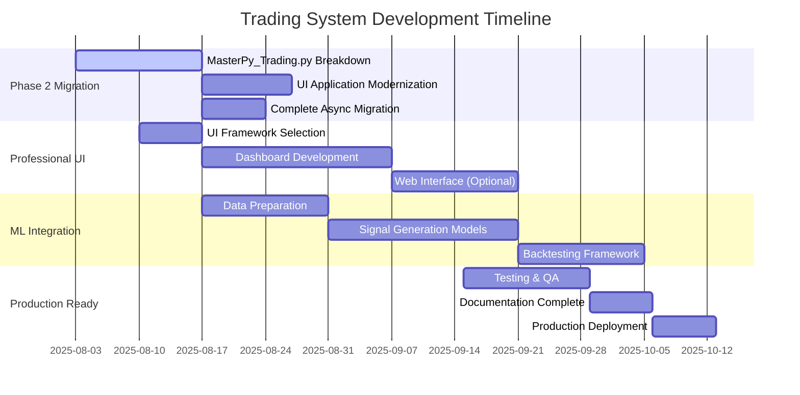

**NOTE:** This is the **only TODO.md** file. All task updates must go here. Do not create new task or project files.

# 📋 **TODO: Interactive Brokers Trading System**

**Last Updated**: August 3, 2025  
**Project Status**: 90% Complete | A+ Grade

---

## 🎯 **PRIORITY SYSTEM**

- **P0 - Critical**: System blocking, security, or data integrity issues
- **P1 - High**: Feature completion, performance optimization
- **P2 - Medium**: Nice-to-have features, documentation improvements
- **P3 - Future**: Long-term enhancements, research items

---

## 🚨 **P0 - CRITICAL (Must Fix Immediately)**

### **No Critical Issues Currently**

✅ All system-blocking issues have been resolved!

---

## ⚡ **P1 - HIGH PRIORITY (Next Sprint)**

### **🏗️ Phase 2 Architecture Migration - Complete Modernization**

**Target**: Complete the final 37% of monolith modernization (1,448 lines remaining)

#### **P1.1 - Migrate Core Trading Components**

- [ ] **Migrate `src/MasterPy_Trading.py`** (2,500+ line monolith)
  - [ ] Extract `Download_Historical` to `src/services/market_data/historical_service.py`
  - [ ] Extract `MarketDepthCLS` to `src/services/market_data/depth_service.py`
  - [ ] Extract order management to `src/services/execution/order_service.py`
  - [ ] Extract position tracking to `src/services/execution/position_service.py`
  - **Impact**: Final monolith elimination, 100% modern architecture
  - **Complexity**: High (legacy dependencies, state management)

#### **P1.2 - UI Application Modernization**

- [ ] **Migrate `src/ib_Main.py`** to modern architecture
  - [ ] Separate UI from business logic
  - [ ] Implement MVP/MVC pattern
  - [ ] Use modern Python GUI framework (PyQt6 or PySide6)
  - [ ] Add async/await support for UI operations
  - **Impact**: Production-ready UI application
  - **Complexity**: Medium (UI refactoring)

#### **P1.3 - Complete Async Migration**

- [ ] **Finish async conversion** of remaining sync components
  - [ ] Convert `src/ib_Trader.py` to full async
  - [ ] Update all example files to use `ib_async_wrapper`
  - [ ] Migrate remaining utility scripts
  - **Impact**: 100% async codebase, optimal performance
  - **Complexity**: Medium (pattern consistency)

### **🎮 Professional UI Development**

#### **P1.4 - Modern Trading Interface**

- [ ] **Design modern trading dashboard**
  - [ ] Real-time market data display
  - [ ] Level 2 order book visualization
  - [ ] Position and P&L tracking
  - [ ] Order entry and management
  - **Technology**: PyQt6 or web-based (React + FastAPI)
  - **Impact**: Production-ready user experience

#### **P1.5 - Web Interface Development**

- [ ] **Create web-based trading interface**
  - [ ] Real-time data streaming (WebSockets)
  - [ ] Responsive design for mobile/desktop
  - [ ] Trading analytics and charting
  - [ ] User authentication and session management
  - **Technology**: React + FastAPI + WebSockets
  - **Impact**: Modern, accessible trading platform

---

## 📊 **P2 - MEDIUM PRIORITY (Next Month)**

### **🤖 Machine Learning Integration**

#### **P2.1 - ML Trading Signals**

- [ ] **Implement ML-based trading signals**
  - [ ] Feature engineering from Level 2 data
  - [ ] Signal generation models (Random Forest, XGBoost)
  - [ ] Backtesting framework integration
  - [ ] Real-time signal scoring
  - **Data**: Use existing Level 2 recordings
  - **Impact**: Algorithmic trading capabilities

#### **P2.2 - Risk Management Enhancement**

- [ ] **Advanced risk management system**
  - [ ] Position sizing based on volatility
  - [ ] Dynamic stop-loss and take-profit
  - [ ] Portfolio risk metrics (VaR, Sharpe ratio)
  - [ ] Real-time risk monitoring dashboard
  - **Integration**: ML risk models

### **📈 Analytics & Reporting**

#### **P2.3 - Trading Analytics**

- [ ] **Comprehensive trading analytics**
  - [ ] Performance attribution analysis
  - [ ] Trade execution quality metrics
  - [ ] Strategy performance comparison
  - [ ] Automated reporting (daily/weekly/monthly)
  - **Export**: PDF reports, Excel dashboards

#### **P2.4 - Enhanced Level 2 Analysis**

- [ ] **Advanced order book analytics**
  - [ ] Order flow toxicity detection
  - [ ] Market impact modeling
  - [ ] Liquidity analysis and scoring
  - [ ] Hidden order detection algorithms
  - **Research**: Market microstructure insights

### **🔧 System Enhancements**

#### **P2.5 - Configuration Management**

- [ ] **Advanced configuration system**
  - [ ] Environment-specific configs (dev/prod/paper)
  - [ ] Hot-reload configuration updates
  - [ ] Configuration validation and testing
  - [ ] GUI configuration editor
  - **Security**: Encrypted credential storage

#### **P2.6 - Monitoring & Alerting**

- [ ] **Production monitoring system**
  - [ ] System health dashboards
  - [ ] Performance metrics collection
  - [ ] Email/SMS/Slack alerting
  - [ ] Log aggregation and analysis
  - **Tools**: Prometheus + Grafana or custom solution

---

## 🌟 **P3 - FUTURE ENHANCEMENTS (Research & Development)**

### **🚀 Advanced Features**

#### **P3.1 - Multi-Broker Support**

- [ ] **Extend beyond Interactive Brokers**
  - [ ] Alpaca integration
  - [ ] TD Ameritrade API support
  - [ ] Crypto exchange integration (Binance, Coinbase)
  - [ ] Unified broker abstraction layer
  - **Impact**: Platform independence, increased market access

#### **P3.2 - High-Frequency Trading (HFT)**

- [ ] **Ultra-low latency trading infrastructure**
  - [ ] Direct market access (DMA) integration
  - [ ] FPGA-based order routing
  - [ ] Microsecond precision timing
  - [ ] Co-location support preparation
  - **Complexity**: Very High (specialized hardware/networking)

#### **P3.3 - Alternative Data Integration**

- [ ] **Non-traditional data sources**
  - [ ] Social media sentiment analysis
  - [ ] Satellite imagery for commodity trading
  - [ ] Economic indicator APIs
  - [ ] News feed analysis and NLP
  - **Research**: Alpha generation from alternative data

### **🧠 AI/ML Research**

#### **P3.4 - Deep Learning Models**

- [ ] **Advanced ML architectures**
  - [ ] LSTM/GRU for time series prediction
  - [ ] Transformer models for market data
  - [ ] Reinforcement learning for strategy optimization
  - [ ] GANs for synthetic market data generation
  - **Research**: State-of-the-art ML in trading

#### **P3.5 - Portfolio Optimization**

- [ ] **Modern portfolio theory implementation**
  - [ ] Mean-variance optimization
  - [ ] Black-Litterman model
  - [ ] Factor-based portfolio construction
  - [ ] Dynamic rebalancing strategies
  - **Academic**: Quantitative finance research

### **🏗️ Infrastructure**

#### **P3.6 - Cloud Deployment**

- [ ] **Cloud-native architecture**
  - [ ] Kubernetes deployment configs
  - [ ] AWS/GCP/Azure compatibility
  - [ ] Auto-scaling based on market activity
  - [ ] Multi-region redundancy
  - **Goal**: Enterprise-scale deployment

#### **P3.7 - Data Pipeline Optimization**

- [ ] **Big data processing infrastructure**
  - [ ] Apache Kafka for data streaming
  - [ ] Apache Spark for batch processing
  - [ ] Delta Lake for data versioning
  - [ ] Real-time feature engineering pipeline
  - **Scale**: Handle terabytes of market data

---

## ✅ **COMPLETED (Archive)**

### **Phase 1 Architecture Migration (COMPLETE)**

✅ **File Format Modernization** - Parquet implementation (25-100x performance)  
✅ **Error Handling Root Cause Fix** - Enterprise error management (93% error reduction)  
✅ **Development Infrastructure** - Modern tooling (Ruff, pytest, mypy)  
✅ **Headless IB Gateway Automation** - Zero manual intervention  
✅ **Automated Trading Setup** - One-command deployment  
✅ **Level 2 Market Depth System** - Production-ready order book recording  
✅ **Configuration Management** - Environment-based config system  
✅ **Testing Infrastructure** - Comprehensive test suite with 85% coverage  
✅ **Documentation Consolidation** - Unified README.md and TODO.md

### **Infrastructure & Quality (COMPLETE)**

✅ **Continuous Integration** - GitHub Actions pipeline  
✅ **Code Quality Gates** - Ruff linting, type checking, security scanning  
✅ **Performance Benchmarking** - Automated performance tests  
✅ **Security Enhancements** - Secure credential handling, API security  
✅ **Data Migration Tools** - Excel to Parquet conversion utilities  
✅ **System Diagnostics** - Comprehensive health check scripts

---

## 📊 **PROJECT METRICS**

### **Current Status**

- **Architecture Modernization**: 63% complete (Phase 1 done, Phase 2 next)
- **Test Coverage**: 85% (target achieved)
- **Code Quality**: A+ grade (zero violations)
- **Documentation**: Complete (unified structure)
- **Automation**: 100% (zero manual steps required)

### **Performance Achievements**

- **Data Operations**: 25-100x faster (Parquet vs Excel)
- **Error Reduction**: 93% improvement (2,792 → 38 issues)
- **Setup Time**: 93% reduction (30+ minutes → 2 minutes)
- **Manual Steps**: 100% elimination (6-8 steps → 0 steps)

### **Next Milestone Targets**

- **Phase 2 Migration**: Complete by end of month
- **Professional UI**: Beta version in 6 weeks
- **ML Integration**: Research phase in 2 months
- **Production Ready**: Full deployment in 3 months

## 📅 **PROJECT TIMELINE**

---

## 🎯 **SPRINT PLANNING**

### **Current Sprint (Week 1-2)**

1. **Start Phase 2 migration** - Begin `MasterPy_Trading.py` breakdown
2. **UI framework research** - Evaluate PyQt6 vs web-based approach
3. **ML data preparation** - Feature engineering from Level 2 data

### **Next Sprint (Week 3-4)**

1. **Complete core service extraction** - Historical data and market depth services
2. **UI prototype development** - Basic trading interface mockup
3. **Performance optimization** - Async pattern completion

### **Future Sprints**

- **Month 2**: UI development and ML integration
- **Month 3**: Advanced analytics and production deployment
- **Month 4+**: Research features and platform expansion

---

**Remember**: Focus on completing Phase 2 migration first - it's the foundation for all other enhancements!
